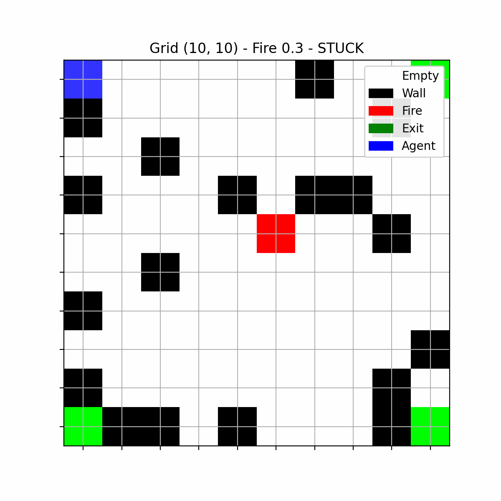

```markdown
# AI Fire Escape Agent 🏃🔥

A simulation project to evaluate the performance of intelligent agents navigating a building fire escape scenario under increasing environmental complexity.

By [Atul Sunil](https://github.com/ATUL-SUNIL)

---

## 📝 Project Overview

This project explores the research question:

> **"How do different AI algorithms perform in fire escape scenarios with increasing complexity?"**

I designed an agent-based simulation where:
- Fire spreads dynamically across a grid-world
- An agent must reach an exit without being trapped by fire

---

## 💻 Technologies Used

- Python 3.10+
- Numpy
- Matplotlib
- Plotly
- Custom grid environment + intelligent agents

---

## 🧠 Agents Implemented

| Agent Type | Description |
|------------|-------------|
| **Reactive Agent** | Rule-based agent with simple movement rules |
| **Search Agent** | A* search agent that computes shortest safe path |
| **Q-Learning Agent** | Reinforcement learning agent trained over multiple episodes |

Agents were tested on multiple:
- Grid sizes (`10x10`, `15x15`)
- Fire spread rates (`0.1`, `0.3`, `0.5`)

---

## 🏗️ Project Structure

```

AI-Fire-Escape-Agent/
├── agents/                  # Agent classes
├── env/                     # Fire escape environment
├── results/                 # Q-tables, outputs, animations
├── train\_q\_agent.py         # Q-learning batch trainer
├── run\_experiments.py       # Main evaluation experiments
├── animate\_agent\_episode.py # Episode animation generator
├── interactive\_agent\_comparison.py # Interactive results plot
├── plot\_success\_curve.py    # (Optional) success rate visualisation
├── README.md                # Project documentation

```

---

## 🚀 How to Run

1️⃣ Clone the repository:
```

git clone [git@github.com](mailto:git@github.com)\:ATUL-SUNIL/AI-Fire-Escape-Agent.git
cd AI-Fire-Escape-Agent

```

2️⃣ Install requirements:
```

pip install numpy matplotlib plotly

```

3️⃣ Train Q-learning agents:
```

python train\_q\_agent.py

```

4️⃣ Run evaluation experiments:
```

python run\_experiments.py

```

5️⃣ Generate visualizations:
```

python animate\_agent\_episode.py
python interactive\_agent\_comparison.py

```

---

## 🎥 Example Animation



```

results/agent\_manual\_colors\_10x10\_fs03.gif

```

---

## 📊 Example Results Plot

Run:
```

python interactive\_agent\_comparison.py

```

Shows side-by-side success rates of all agents across grid sizes and fire spreads.

---

## 💡 Key Findings

- **Search Agent (A\*)** consistently performed best in small grids by guaranteeing shortest paths
- **Q-Learning Agent** showed strong performance but suffered from incomplete exploration in limited training episodes
- **Reactive Agent** performed worst due to simplistic rule set

---

## 🎓 Coursework Reflection

This project demonstrates:
- Robust environment design
- Comparison of classical search, reinforcement learning, and reactive AI approaches
- Reproducibility and clear visual evaluation

Developed under COMP3004 / COMP4105 - Designing Intelligent Agents module at University of Nottingham.

---

## 📋 Future Work

- Adding diagonal movement
- Multi-agent cooperative escape strategies
- Testing on larger dynamic grid environments

---

## 📜 License

This project was developed for educational and academic purposes only.
```

---
